# **Crafty Tukka**

## **T3A2-A - Full Stack App (Part A)**

### An application created by Simon Tanna and Jason Sandeman

---

### **[Click here](https://github.com/Crafty-Tukka/CraftyTukkaDocs)** to access the GitHub Repository for this file

---

## Table of Contents

* [1. Purpose](#1-purpose)
* [2. Functionality / Features](#2-functionality-and-features)
* [3. Target Audience](#3-target-audience)
* [4. Tech Stack](#4-tech-stack)
* [5. User Stories](#5-user-stories)
  * [5.1 Concept Personas](#51-concept-personas)
  * [5.2 User Story Development](#52-user-story-development)
  * [5.3 User Story Management](#53-user-story-management)
  * [5.4 Final User Stories](#54-final-user-stories)
    * [5.4.1 General Public User](#541-general-public-user)
    * [5.4.2 Food Truck Operator](#542-food-truck-operator)
    * [5.4.3 Venue](#543-venue)
* [6. Application Architecture Diagram](#6-application-architecture-diagram)
* [7. Dataflow Diagrams](#7-dataflow-diagrams)
  * [7.1 Application Overview](#71-application-overview)
  * [7.2 Venue Dataflow Layer](#72-venue-dataflow-layer)
  * [7.3 Food Truck Dataflow Layer](#73-food-truck-dataflow-layer)
* [8. Wireframes](#8-wireframes)
  * [8.1 Planning and Implementation](#81-planning-and-implementation)
  * [8.2 Wireframe Images](#82-wireframe-images)
    * [8.2.1 Landing Page Views](#821-landing-page-views)
    * [8.2.2 Map View With Event Details](#822-map-view-with-event-details)
    * [8.2.3 Food Truck List and Details Views](#823-food-truck-list-and-details-views)
    * [8.2.4 Venue List and Details Views](#824-venue-list-and-details-views)
    * [8.2.5 Venue and Food Truck Filter Views](#825-venue-and-food-truck-filter-views)
    * [8.2.6 Registered User Sign In Views](#826-registered-user-sign-in-views)
    * [8.2.7 Food Truck and Venue Sign Up Views](#827-food-truck-and-venue-sign-up-views)
    * [8.2.8 Food Truck Booking Request and Prior Booking Screens](#828-food-truck-booking-request-and-prior-booking-screens)
    * [8.2.9 Registered User Dashboard and Existing Booking Screen](#829-registered-user-dashboard-and-existing-booking-screen)
* [9. Project Management](#9-project-management)
  * [9.1 Methodology](#91-methodology)
  * [9.2 Workflow](#92-workflow)
  * [9.3 Task Management](#93-task-management)
    * [9.3.1 General Tasks](#931-general-tasks)
    * [9.3.2 User Story Tasks](#932-user-story-tasks)

---

### **1. Purpose**

In recent years, the city of Brisbane has seen the rise of numerous independent craft breweries whose locations range from the inner-city through to the outer-suburbs. Many of these breweries serve as community hubs where people can go to enjoy a locally produced beverage and quite often, purchase culinary offerings from one of the fantastic food trucks that operate in this great city.

A challenge faced by breweries wishing to book a food truck has been the inability for them to instantly view the availability of a truck before making a booking request directly to the business operator. Quite often, this results in a brewery having to contact numerous food truck operators before they find one that is available for a particular day and time.

Customers who wish to know what food truck will be at a particular brewery location at a given date and time can struggle to easily find this information. Usually it is achieved by trawling through the breweries or food truck businesses' social media channels in hope that they have posted their upcoming events for the week.

Crafty Tukka is a web application that aims to solve these problems by facilitating bookings between breweries and food truck operators and then displaying them with an easy to navigate user interface.

---

### **2. Functionality and Features**

Crafty Tukka features 2 types of user accounts that require an initial sign-up and secure login credentials: _Venue and Food Truck_.

Upon creating a new account, both brewery venues and food truck operators will be required to enter general information such as the _business name, description, email and phone number_ with an option to include a _website and social media links_. Unique fields exist for each type of account with breweries being required to provide an _address_ and food trucks a _cuisine category_.

Once registered and logged in, a brewery venue will be able to search for food trucks that are available on a given day while having the option to filter the list of food trucks by cuisine type. When the venue has found a food truck that they wish to book, they will be able to send a booking request to the truck operator who will be alerted of the request and then able to either accept or reject the request. Both user types are able to view, edit and cancel bookings.

When a booking between a venue and a food truck is confirmed, the details of the booking are added to the Crafty Tukka main page. This page features a map with pins showing the location of food truck events happening today with a list of upcoming events displayed adjacent to the map.

Any member of the public can view the map and event list. They also have the ability to view the individual details of all food trucks and venues.

---

### **3. Target Audience**

The Crafty Tukka application was created for use by food truck and brewery businesses in Brisbane. It also aims to serve members of the general public who wish to find out which breweries are hosting food trucks on a given day.

---

### **4. Tech Stack**

| Front-End   | Back-End      | Tools     | Dev-Ops | Deployment | Testing     |
| ----------- | ------------- | --------- | ------- | ---------- | ----------- |
| React.js    | Ruby on Rails | Draw.io   | Git     | Heroku     | Jest        |
| HTML5       | Ruby          | Whimsical | GitHub  | Netlify    | Rspec Rails |
| CSS3        | Postgresql    | Notion    | VS Code |            |             |
| JSX         | Bcrypt        | Discord   |         |            |             |
| Axios       | Knock         |           |         |            |             |
| Material UI |               |           |         |            |             |

---

### **5. User Stories**

#### **[Link to User Stories Kanban Board](https://www.notion.so/jwsandeman/R4-User-Stories-433e840137fb4c10b220427071b6b4b9)**

#### **5.1 Concept Personas**

The developers of Crafty Tukka created **four** personas whose needs have guided how the application looks and functions:

1. **The Craft Brewery Patron**

   - Visits craft breweries on a regular to semi-regular basis.
   - Is happy to make a journey across town to visit a particular brewery or attend an event held at one.
   - Enjoys the social environment created by a craft brewery and will often visit one with family and friends.
   - Choice of visited brewery sometimes dictated by the choice of food or entertainment on offer.

1. **The Food-Truck Foodie**

   - A culinary adventurer who is seeking the best food truck fare that Brisbane has to offer.
   - Has favourite food trucks that they will seek out on a regular basis.
   - Will actively search for trucks and cuisines which they have not tried yet.

1. **The Brewery Events Coordinator**

   - Responsible for organising and marketing events to be held at the brewery.
   - Looks for unique and innovative themes concepts to attract patrons to the venue.
   - Is time-poor as this role is often part-time or shared with other brewery duties.
   - Handles social media posts and online promotion of the venue.
   - Requires tools to make the performace of their role more efficent and effective.

1. **The Food Truck Operator**
   - A small business owner/operator whose existence depends of securing ongoing locations in which to trade.
   - Responsible for their own marketing, social media accounts and brand awareness.
   - Takes great pride in creating high-quality food.
   - Cost margins are often razor-thin so having a full operating schedule with access to adequate patronage is essential to the viability of the business.
   - Is looking for ways to make the operation of the business more cost and time efficient.

#### **5.2 User Story Development**

Following the creation of the four concept personas, the development team determined which functions each user would want to perform in the application. If was determined that the _Craft Brewery Patron_ and _Food Truck Foodie_ personas shared overlapping needs and were therefore amalgamated into a single _General Public_ user type. The joining of these personas into the one user story was possible due to the fact that they did not require authentication to use the application.

Amendments to the actions a _Food Truck_ user type could perform were also made after consideration of real-world requirements. An example of this occurred where, in the original user story, a _Food Truck_ user could request a booking from a _Brewery Venue_ user. Upon consultation with brewery venues, it was determined that this feature would not be desired by breweries and add unnecessary complexity to the application. As a result, the feature of food trucks requesting bookings from a venue was scrapped from their story.

#### **5.3 User Story Management**

In order to manage the application user stories, the developers created a kanban board dedicated to tracking their changes and implementation. The board categorises each user story as _Minimum Viable Product_ (MVP) or _Sprinkles_ (optional features). Within each of these categories, the stories are tagged with the attriutes _Epic_ (User Type) and _Priority_ for ease of identification and are assigned a unique number identifier for referencing in the development phase. Stories that have been removed from either MVP and Sprinkles shifted into a Backlog list.

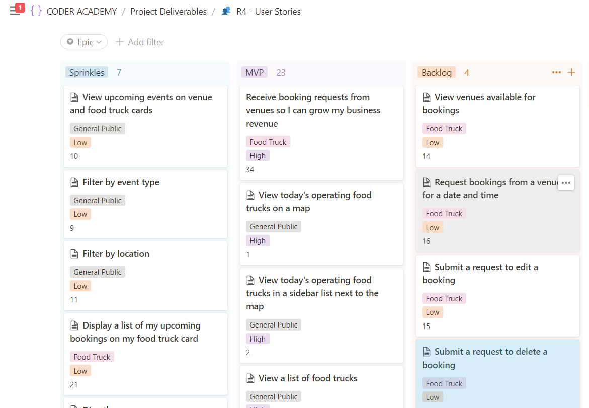

#### **5.4 Final User Stories**

Using the concept personas a guide, the developers of Crafty Tukka created clear stories for the **three** user types that will interact with the application. The aim of creating a streamlined _Minimum Viable Product_ (MVP) guided what was to be initially included and excluded from each user story. A committment to constantly seek feedback from users during development and production means that these stories are subject to change.

#### **5.4.1 General Public User**

As a General Public user type:

| **I want to...**                                                     | **So I can...**                                        | **Related Feature**                                       |
| -------------------------------------------------------------------- | ------------------------------------------------------ | --------------------------------------------------------- |
| View today's operating food trucks on a map                          | See a visual location of today's events                | Home page map with venue pins                             |
| View today's operating food trucks in a sidebar list next to the map | Quickly reference each event's details                 | Home page map sidebar                                     |
| View a list of all registered food trucks                            | Select a food truck to find out more about them        | Access via a _view trucks_ navbar link                    |
| View a list of venues                                                | Select a venue to find out more about them             | Access via a _view venues_ navbar link                    |
| View the details of a particular food truck                          | View their bookings, website and socials               | Access via a clickable link on each truck                 |
| View the details of a particular venue                               | View their website and socials                         | Access via a clickable link on each venue                 |
| Filter food trucks by cuisine type                                   | Narrow down my search results to help me make a choice | Access via a dropdown menu in the _view trucks_ component |
| Filter venues by event date                                          | Narrow down my search results to help me make a choice | Access via a dropdown menu in the _view venues_ component |

#### **5.4.2 Food Truck Operator**

As a Food Truck Operator user type:

| **I want to...**                                           | **So I can...**                                                 | **Related Feature**                                                                    |
| ---------------------------------------------------------- | --------------------------------------------------------------- | -------------------------------------------------------------------------------------- |
| Be able to do everything that a General Public user can do | Keep up to date on the status of current venues and competitors |                                                                                        |
| Sign up as a food truck user type                          | Have venues contact me to make a booking                        | Sign up page accessible from navbar                                                    |
| Receive booking requests from venues                       | Grow my business revenue                                        | A booking request alert in which the truck can accept or reject booking                |
| Define my primary cuisine category                         | Have users find my food truck by cuisine                        |                                                                                        |
| Log in and out using secure credentials                    | Be confident that my private information is secure              | Created using brcrypt and knock authentication                                         |
| View my existing bookings                                  | Be aware of my upcoming obligations                             | Access via clickable link in the user dashboard                                        |
| View my pending bookings                                   | Approve or reject them                                          | Access via clickable link in the user dashboard                                        |
| Upload my business image as an avatar                      | Have recognisable branding on the map                           | Required at the time of sign up and can be edited by the user in the edit profile page |

#### **5.4.3 Venue**

As a Venue user type:

| **I want to...**                                                                                | **So I can...**                                                                                 | **Related Feature**                                                                                               |
| ----------------------------------------------------------------------------------------------- | ----------------------------------------------------------------------------------------------- | ----------------------------------------------------------------------------------------------------------------- |
| Be able to do everything that a General Public user can do                                      | Keep up to date on the status of current food trucks and competitors                            |                                                                                                                   |
| Sign up as a venue user type                                                                    | Make bookings with food trucks                                                                  | Sign up page accessible from navbar                                                                               |
| Log in and out using secure credentials                                                         | Be confident that my private information is secure                                              | Created using brcrypt and knock authentication                                                                    |
| View available food trucks                                                                      | Target food truck bookings appropriately                                                        | Access via a date select tab in the _create booking_ page                                                         |
| Request bookings from a food truck whose availability on a particular day and time is displayed | Have confidence that I am not wasting my time by requesting a booking from an unavailable truck | Trucks who have existing bookings on a day are excluded from list of trucks                                       |
| Submit a request to edit a booking                                                              | Make changes if necessary                                                                       | Access via clickable link in the _my existing bookings page_                                                      |
| Submit a request to delete a booking                                                            | Make changes if necessary                                                                       | Access via clickable link in the _my existing bookings page_                                                      |
| View my existing bookings                                                                       | Be aware of my upcoming obligations                                                             | Access via clickable link in the user dashboard                                                                   |
| View my pending bookings                                                                        | See if a food truck has approved or rejected them                                               | If a booking is rejected, the venue has the ability to request a new truck without having to create a new booking |
| Upload my business image as an avatar                                                           | Have recognisable branding on the map                                                           | Required at the time of sign up and can be edited by the user in the edit profile page                            |

---

### **6. Application Architecture Diagram**

## 

### **7. Dataflow Diagrams**

#### 7.1 Application Overview

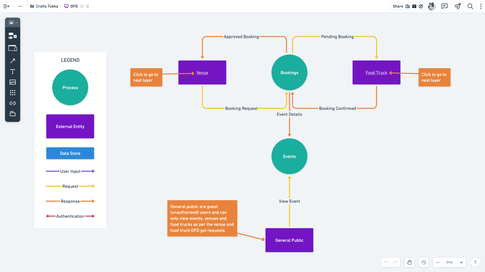

[Link to Application Overview](https://whimsical.com/dfd-UYijwupffZf9VuHwkgBfZz@2Ux7TurymMpnj9rEL1ao)

#### 7.2 Venue Dataflow Layer

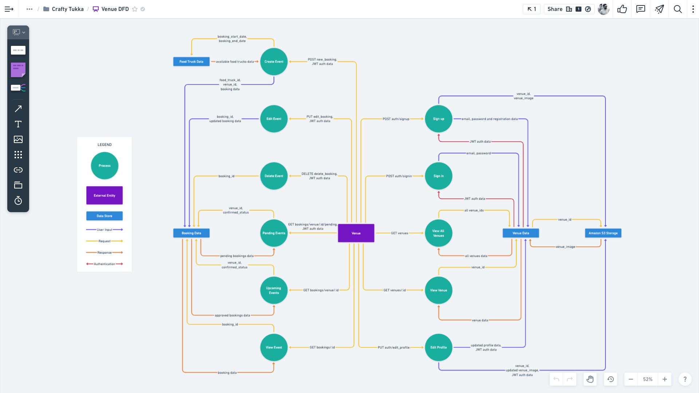

[Link to Venue Layer](https://whimsical.com/venue-dfd-U57MzhephLnUd5mjr9o8Nc@7YNFXnKbYm3i3AC1kTND4)

#### 7.3 Food Truck Dataflow Layer

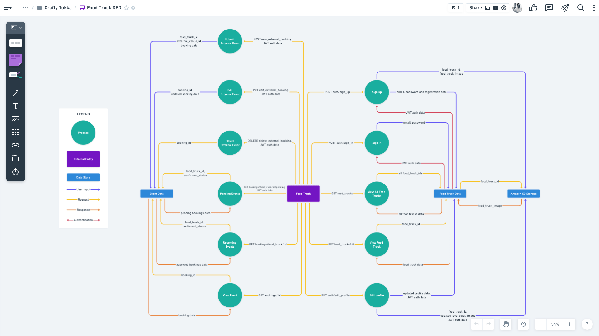

[Link to Food Truck Layer](https://whimsical.com/food-truck-dfd-Rx5N3XNnpAL9jSJsnZmjzP@2Ux7TurymMUDEU2nufYw)

---

### **8. Wireframes**

#### [Link to all wireframes](https://whimsical.com/wireframes-RB4cHUJf4FAsVbC8ZHvPan@VsSo8s35VHC849dBSrUayJ)

#### [Link to annotated wireframes](https://whimsical.com/wireframes-formatted-for-user-stories-Cy8xZSgH1meeDS3Gn3q3gw@AhRp651J2qt6EUf5aRbrwNM8P)

#### 8.1 Planning and Implementation

When creating the wireframes for Crafty Tukka, the developers were guided by the requirements of each user story/epic with priority given to minimum viable product (MVP) features. As all users of the application will be able to perform the actions of a _general public_ user type, the developers prioritised the development of the wireframes for their page views before starting on those for the _venue_ and _food truck_ users.

Each wireframe was annotated with a reference to the corresponding user stories and links inserted into the [User Story Card](https://www.notion.so/jwsandeman/Define-my-primary-cuisine-category-947e6243bd2240ec8773e8a2e98865fb) components of the [User Stories Kanban Board](https://www.notion.so/jwsandeman/R4-User-Stories-433e840137fb4c10b220427071b6b4b9).

A _mobile first_ methodology will be used in the development of the application components and this has been reflected through careful consideration of UX/UI features in the mobile views.

Below are examples of how each user story is to be rendered in mobile, tablet and desktop views with links provided to the corresponding user stories.

#### **8.2 Wireframe Images**

#### 8.2.1 Landing Page Views

Referencing **[MVP User Story #1](https://jwsandeman.notion.site/View-today-s-operating-food-trucks-on-a-map-9d7e0e18537246aba2c5683e42fff3e6)**

#### 8.2.2 Map View With Event Details

Referencing **[MVP User Story #2](https://jwsandeman.notion.site/View-today-s-operating-food-truck-events-in-a-sidebar-list-next-to-the-map-f8a9edd85c7144cdb8c60cc018c325fa)**
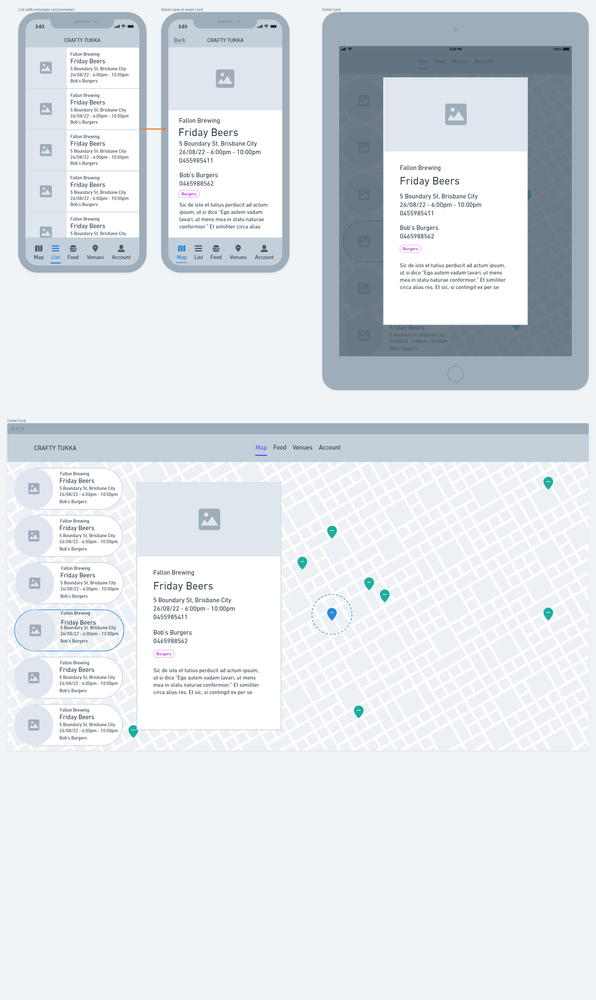

#### 8.2.3 Food Truck List and Details Views

Referencing **[MVP User Story #3](https://www.notion.so/jwsandeman/View-a-list-of-food-trucks-37be7a3edf824e7c8427f4456af1c5a2)** and **[MVP User Story #7](https://jwsandeman.notion.site/View-the-details-of-a-particular-food-truck-402c2caa83cf4414a16a9c3264ec3b61)**

#### 8.2.4 Venue List and Details Views

Referencing **[MVP User Story #4](https://www.notion.so/jwsandeman/View-a-list-of-venues-54307186ee1741c5890f92c000045038)** and **[MVP User Story #8](https://www.notion.so/jwsandeman/View-the-details-of-a-particular-venue-6e8ab0c0e1274c6e880116d8dba2b25a)**

#### 8.2.5 Venue and Food Truck Filter Views

Referencing **[MVP User Story #5](https://jwsandeman.notion.site/Filter-venues-by-date-027e8fd1b6174767918882ed78a5af64)** and **[MVP User Story #6](https://www.notion.so/jwsandeman/Filter-food-trucks-by-cuisine-type-84073effae814eec9bde136fa73467d8)**
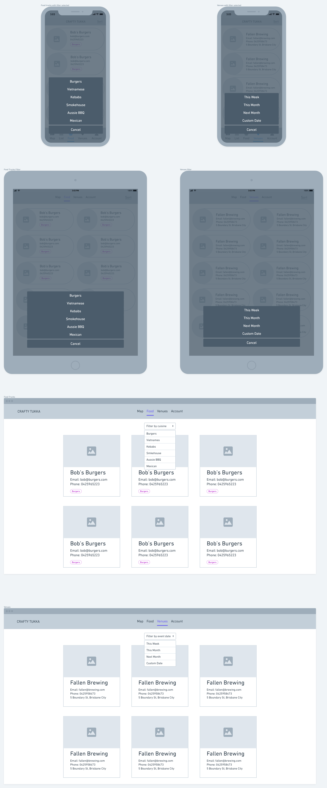

#### 8.2.6 Registered User Sign In Views

Referencing **[MVP User Story 12](https://www.notion.so/jwsandeman/Log-in-and-out-using-secure-credentials-3100c2eb02234785886797b0d3bb4363)** and **[MVP User Story 25](https://jwsandeman.notion.site/Log-in-and-out-using-secure-credentials-646984d86a024af8ad6f1d778dd113ac)**
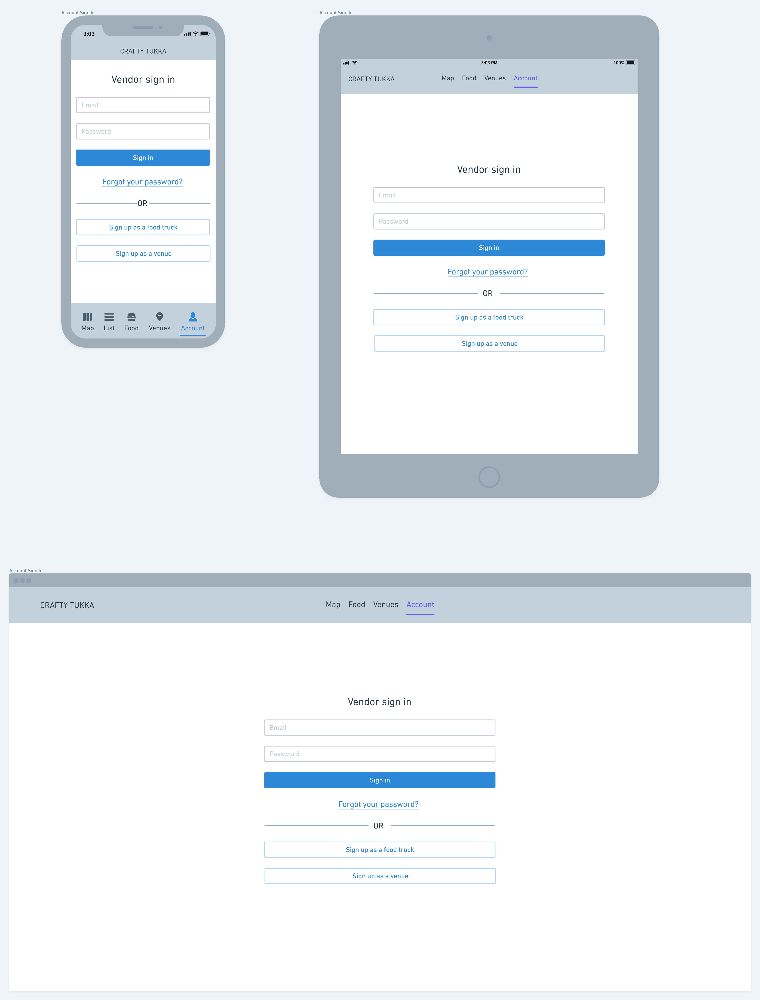

#### 8.2.7 Food Truck and Venue Sign Up Views

Referencing **[MVP User Story 13](https://www.notion.so/jwsandeman/Sign-up-as-a-food-truck-user-type-5470fdb780cf47eda7d70e145f7170de)** and **[MVP User Story 23](https://www.notion.so/jwsandeman/Sign-up-as-a-venue-user-type-68d84723ce6347f199c3cba6c1f4d92b)**

#### 8.2.8 Food Truck Booking Request and Prior Booking Screens

Referencing **[MVP User Story 26](https://www.notion.so/jwsandeman/Request-bookings-from-a-Food-Truck-for-a-date-and-time-61032872b1f94ef0997b099911e4ed30)**

#### 8.2.9 Registered User Dashboard and Existing Booking Screen

Referencing **[MVP User Story 19](https://www.notion.so/jwsandeman/View-my-existing-bookings-e761fa959d994e93b261cfc6882f3b1d)** and **[MVP User Story 29](https://www.notion.so/jwsandeman/View-my-existing-bookings-8f2eedc720a74cb4a0198119d7b3751f)**
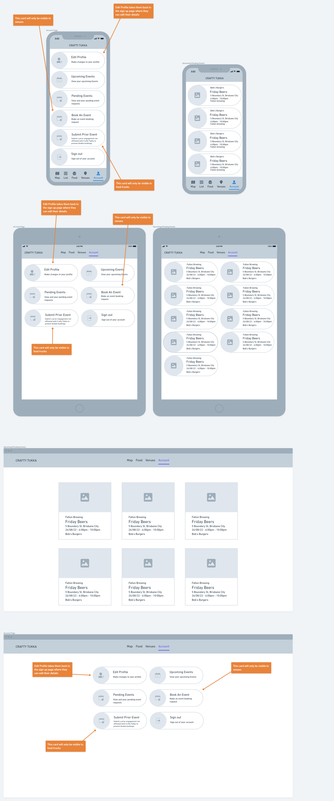

---

### **9. Project Management**

### 9.1 Methodology

We have decided to go with agile methodology with the use of epics and sprints. This allows us to take an iterative approach to our project management and to ensure that we are kept accountable to our goals. We found that by setting up a collaborative workflow environment in Notion we were able to improve our efficiency and reduce any double handling of tasks.

### 9.2 Workflow

The overall project management will be handled by the Project Deliverables timeline that we set up to help keep us accountable to our daily targets. This is the single source of truth for our project and all of our documentation, processes, ideas, goals and code snippets live here.

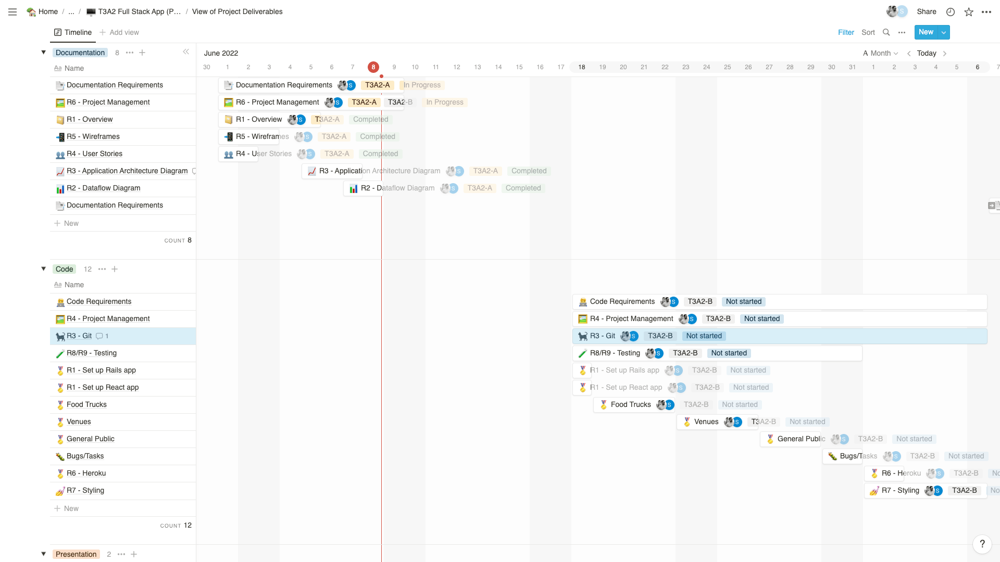

### 9.3 Task Management

#### 9.3.1 General Tasks

General task management will happen on the tasks board which will serve to pick up any once-off project-related tasks that aren't directly related to implementing the epics and sprints. Any Bugs that we come across will also be caught and triaged on this board as well. These will be referenced in the GitHub pull requests as necessary.

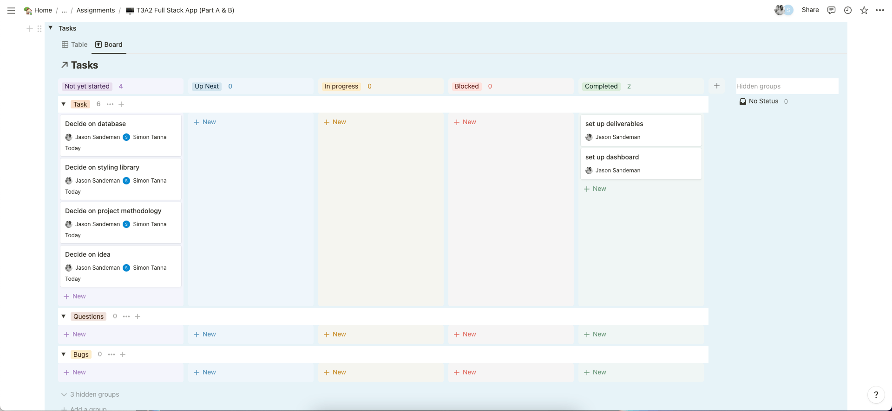

#### 9.3.2 User Story Tasks

Any tasks associated with the epics and sprints will happen in the user stories board and will be referenced in our GitHub pull requests. Each of these individual story cards will be made up of sub-tasks which we will use to help implement the code for the user story.

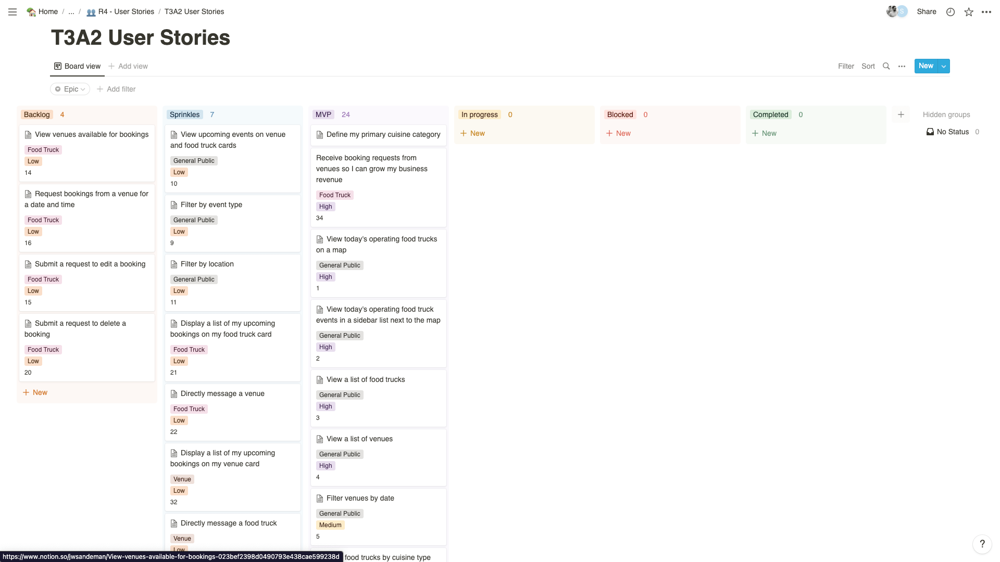
